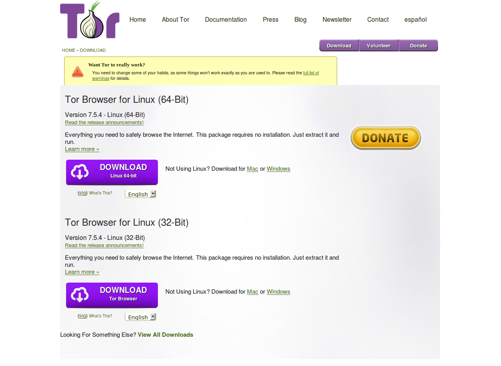
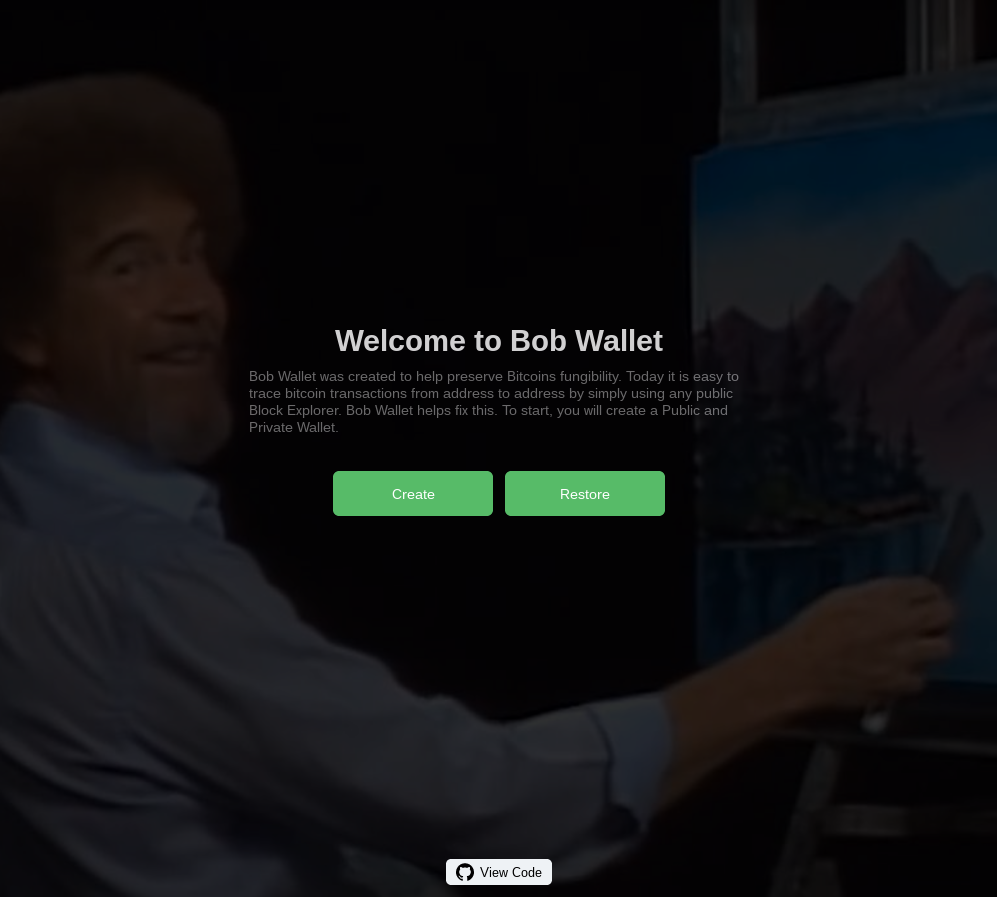
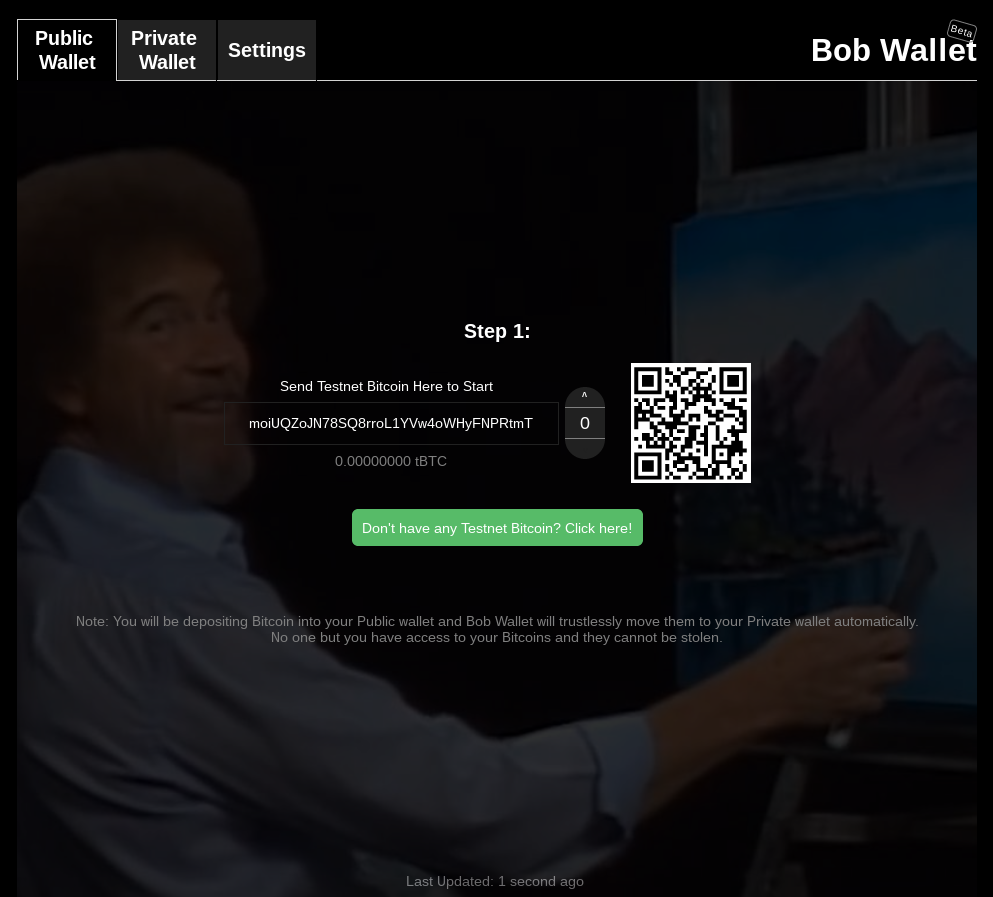
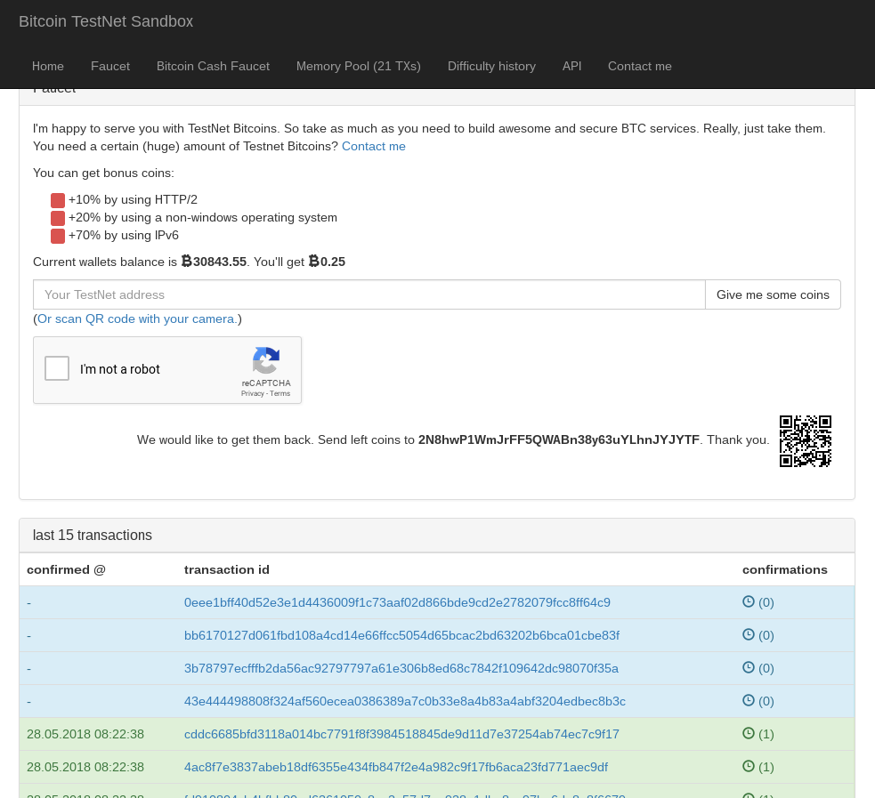
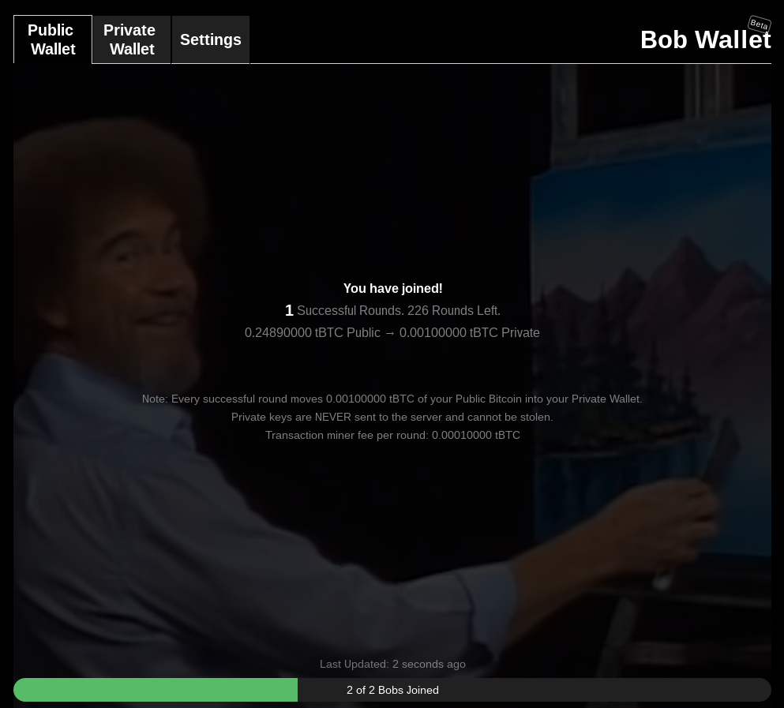
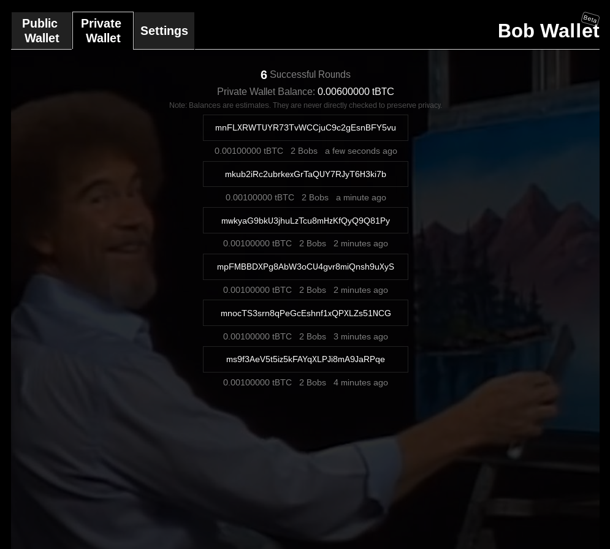
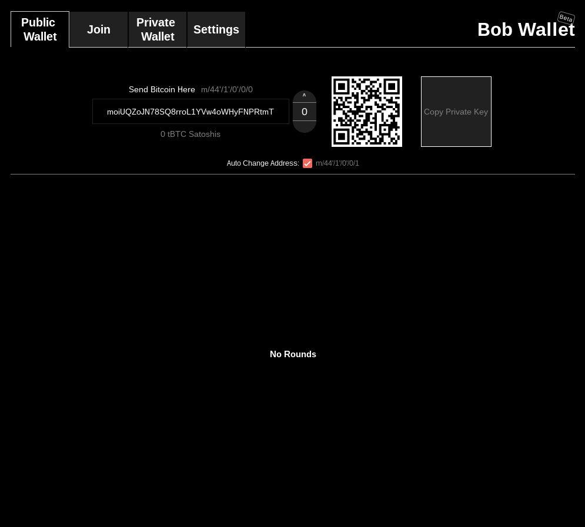
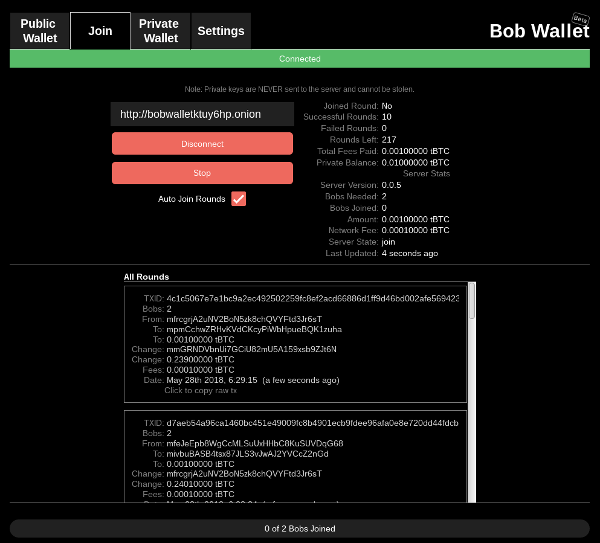

# Bob Wallet User Guide

**Documentation Version 1.0**  
**BobWallet Version 0.0.4**  

Note: The version of Bob Wallet that this guide is written for only runs on the bitcoin testnet.

## Step 1. Download and install the Tor Browser

_If you already have Tor Browser installed, you can skip to Step 2._

Tor Browser is needed to anonymize the connection between Bob Wallet and the mixing server. You can download Tor Browser [here](https://www.torproject.org/download/download-easy.html).

## Step 2. Start Tor Browser and open Bob Wallet

You can open Bob Wallet by visiting the website [http://bobwalletktuy6hp.onion](http://bobwalletktuy6hp.onion) OR [download Bob Wallet](https://github.com/BobWallet/BobWallet/archive/master.zip), unzip the BobWallet zip folder, and open (drag and drop) `bobwallet.html` from the unzipped folder into the Tor Browser.

## Step 3. Create a new Bob Wallet

Click the `Create` button to create a new Bob Wallet then click the `Generate` buttons to generate the seeds for your Public and Private wallets. The Public Wallet is where you will deposit the coins that you would like to mix. The Private Wallet is where the coins will end up after they have been mixed.

Click `Next` then `Download Backup` to proceed to the next screen. Save the backup file somewhere on your computer so you can pick up where you leave off if you need to close Bob Wallet. Since this is only a testnet wallet, you don't have to be as careful about how this backup file is stored as you would be if it were storing real value on the bitcoin mainnet.

_The wallet seeds shown in the image below are only examples and should not be reused in your own wallet._

## Step 4. Deposit testnet bitcoin into your Public Wallet

Click the address shown on the Public Wallet tab of your Bob Wallet to copy the address to your clipboard. Visit [this testnet bitcoin faucet](https://testnet.manu.backend.hamburg/faucet), paste your address, then click `Give me some coins` to have testnet coins sent to your address. You may need to complete a CAPTCHA before the website will let you click the button to receive testnet bitcoins.

## Step 5. Mix your coins

Once the testnet deposit is confirmed, Bob Wallet will automatically enter you into CoinJoin rounds with every other Bob Wallet user. Successful rounds will move coins from your Public Wallet to your Private Wallet. Bob Wallet will automatically add you into subsequent rounds until all of your Public Bitcoin is moved to your Private Wallet.

Bob Wallet must be kept open for the mixing process to happen. If you disconnect during the Join stage you will be removed from the round. If you disconnect mid-round then you will be blamed for stopping the round and a new round will start without you. Right now it is less important if a round is stopped since punishments haven't yet been added and rounds are quick.

## Optional: Change Bob Wallet Settings

There is a Settings tab where you can change Bob Wallet settings, download a backup file, reset and start with a new wallet, and show your wallet seeds. If you try to reset the wallet, Bob Wallet will automatically show a pop up to download a wallet backup file in case you don't have a backup saved yet.

In the Settings tab you can change the denomination shown in your Bob Wallet from bitcoin to satoshis.

You can also enable Pro mode to see what is going on behind the scenes in Bob Wallet and change advanced settings.

## Support Bob Wallet

Contribute code and help document and test Bob Wallet: https://github.com/BobWallet/BobWallet

Help cover the expenses of developing Bob Wallet: 15fMSRKT8pP1XMfc6YM7ckH87uc9YaRcaa
